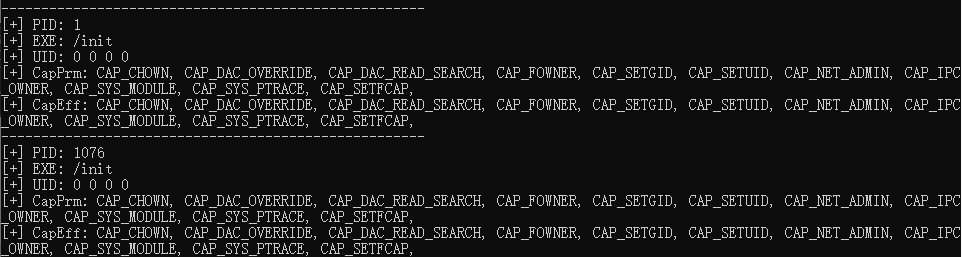

### how2root
[toc]

#### 简介

一个搜索linux 中不安全的权限配置的shell脚本，搜索可能造成提权的危险点。暂时打算只对不安全的配置进行检测，而对于漏洞提权不进行检测，因为只打算写成shell脚本。

之所以用shell脚本写是因为这样就**能在不同架构、普通linux服务器和嵌入式设备之间通用，所以会用支持busybox 的shell 写**，所以代码看起来非常的蠢逼，当然一方面也有我菜的原因。

ps: 目前只针对进程capbilities 进行搜索

后续可能更新点：

- ld相关配置提权
- /dev 下可能危险设备
- 可操作目录搜索
- 查看系统基本信息

#### 覆盖面

- 针对  **全进程 / 所有非root进程**  进行搜索，搜索所有  **拥有高危capbilities / 拥有指定capbilities / 拥有任意capbility** 的进程

  - 高危capbilities：

    ```
    CAP_CHOWN CAP_DAC_OVERRIDE CAP_DAC_READ_SEARCH CAP_FOWNER CAP_SETGID CAP_SETUID CAP_NET_ADMIN CAP_IPC_OWNER CAP_SYS_MODULE CAP_SYS_PTRACE CAP_SETFCAP
    ```

#### 使用方法

##### 输入参数

拥有如下参数：

- --showroot  

  对全进程 (包括root进程) 进行搜索，默认情况下 (不加这个参数) 只搜索非root 进程 (进程uid 不等于0) ，毕竟root 进程本来就是最高权限，拥有什么cap 都是没有意义的。

- -c / --cap   

  指定搜索 某个 / 某些 cap权限，默认状态下我定义了几个高危的capbilities (见上面覆盖面)，默认只搜索拥有这些capbilities 之一 / 多个的进程。但说实话capbilities 都挺危险的，高危只是相对而言，所以这里支持定向搜索，可以使用 -c / --cap 参数搜索一个或多个指定capbilities，如：

  ```shell
  ./capscan.sh -c CAP_DAC_OVERRIDE #只搜索拥有CAP_DAC_OVERRIDE权限的非root进程
  ./capscan.sh -c CAP_DAC_OVERRIDE,CAP_SYS_CHROOT,CAP_NET_BIND_SERVICE #搜索拥有CAP_DAC_OVERRIDE、CAP_SYS_CHROOT和CAP_NET_BIND_SERVICE中任意一个或多个的进程
  ```

  - **不同cap之间用逗号分割，不要有空格，并且只支持大写**

- -a / --all 

  讲搜索范围改为全部capbilities，只要进程拥有任意一个capbility ，就会加入到搜索结果之中。

Example：

```sh
./capscan.sh -a --showroot  #搜索全部进程，并且只要进程拥有任意capbilities，就匹配
./capscan.sh -c CAP_DAC_OVERRIDE,CAP_SYS_CHROOT,CAP_NET_BIND_SERVICE #搜索拥有CAP_DAC_OVERRIDE、CAP_SYS_CHROOT和CAP_NET_BIND_SERVICE中任意一个或多个的进程
```

##### 输出结果



不同进程之间用"------------------------" 分割

- PID: 进程号
- EXE: 进程二进制文件
- UID: 进程uid
- CapPrm: 进程的 primitted capbilities属性
- CapEff: 进程的effective capbilities 属性

#### 原理

直接便利所有进程的status 文件，读取其中的capbilities 字段的值，然后判断是否有对应权限，输出即可。

